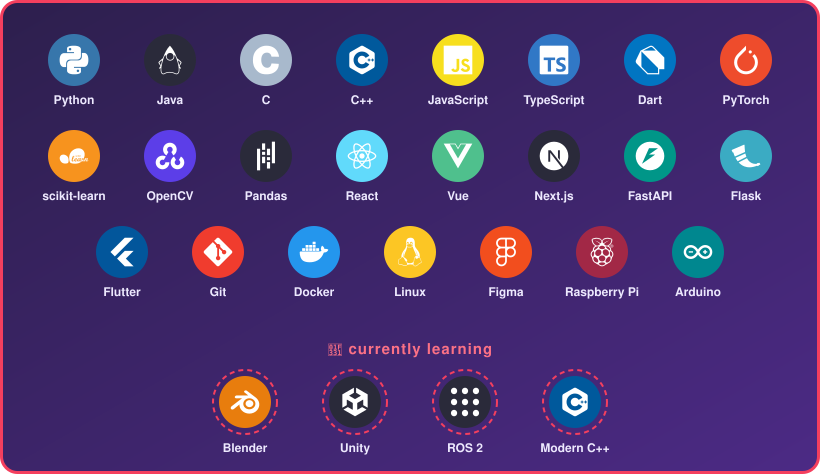

  

  
  
  

## 👩‍💻 About me

I'm a **Systems Engineering** student from Arequipa, Peru. I like building software and AI that solve real problems, and I'm working my way into **robotics** and **virtual reality**.

- I'm currently working on a mini operating system, an ERP module (DevOps & architecture) and a VR rehabilitation research project
- I'm currently learning **ROS 2**, **C++**, and **VR development with Blender & Unity**
- I'm looking to collaborate on **AI, computer vision, VR and robotics** projects
- Ask me about computer vision, machine learning or optimization
- Fun fact: besides Systems Engineering, I also study Business Administration

  <b>Open to:</b>&nbsp;
  
  
  
  

## 🤖 Boot sequence

  

## 🛠️ Tech stack

  

## 🚀 Featured projects

<table>
  <tr>
    <td width="50%" valign="top">
      <h3>🌱 <a href="https://github.com/KarlaBedregal/HackatonFlit">TerraGuard Arequipa</a></h3>
      Predicts heavy-metal contamination risk in Arequipa's crops: computer vision detects plant stress from a leaf photo, combines it with distance to mining sites and soil pH, and a Random Forest estimates the risk level.
        
      
      
      
      
    </td>
    <td width="50%" valign="top">
      <h3>🎮 <a href="https://github.com/KarlaBedregal/YachAI">YachAI</a></h3>
      Gamified learning platform that turns any topic into AI-generated minigames (trivia, adventures, simulations) adapted to the student's level and to the Peruvian local context.
        
      
      
      
      
    </td>
  </tr>
</table>

## 📊 GitHub stats

  
  

  

  <picture>
    <source media="(prefers-color-scheme: dark)" srcset="https://raw.githubusercontent.com/KarlaBedregal/KarlaBedregal/output/snake-dark.svg" />
    <source media="(prefers-color-scheme: light)" srcset="https://raw.githubusercontent.com/KarlaBedregal/KarlaBedregal/output/snake-light.svg" />
    
  </picture>

  

## 📫 Let's connect

  
  

