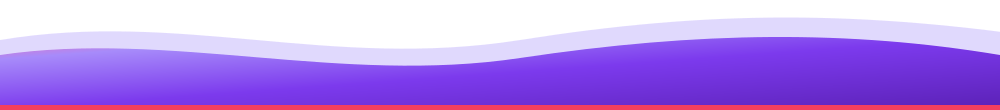

  

  
  
  

## 👩‍💻 About me

I'm a **Systems Engineering** student from Arequipa, Peru 🇵🇪. I like building software and AI that solve real problems, and I'm working my way into **robotics** and **virtual reality**.

- 🔭 I'm currently working on a mini operating system, an ERP module (DevOps & architecture) and a VR rehabilitation research project
- 🌱 I'm currently learning **ROS 2**, **C++**, and **VR development with Blender & Unity**
- 👯 I'm looking to collaborate on **AI, computer vision, VR and robotics** projects
- 💬 Ask me about computer vision, machine learning or optimization
- ⚡ Fun fact: besides Systems Engineering, I also study Business Administration

## 🤖 Boot sequence

  

## 🛠️ Tech stack

<h4>💻 Languages</h4>
<table>
  <tr>
    <td align="center" width="96"> <b>Python</b></td>
    <td align="center" width="96"> <b>Java</b></td>
    <td align="center" width="96"> <b>C</b></td>
    <td align="center" width="96"> <b>C++</b></td>
    <td align="center" width="96"> <b>JavaScript</b></td>
    <td align="center" width="96"> <b>TypeScript</b></td>
    <td align="center" width="96"> <b>Dart</b></td>
  </tr>
</table>

<h4>🧠 AI & Data</h4>
<table>
  <tr>
    <td align="center" width="96"> <b>PyTorch</b></td>
    <td align="center" width="96"> <b>scikit-learn</b></td>
    <td align="center" width="96"> <b>OpenCV</b></td>
  </tr>
</table>

<h4>🌐 Web & Mobile</h4>
<table>
  <tr>
    <td align="center" width="96"> <b>React</b></td>
    <td align="center" width="96"> <b>Vue</b></td>
    <td align="center" width="96"> <b>Next.js</b></td>
    <td align="center" width="96"> <b>FastAPI</b></td>
    <td align="center" width="96"> <b>Flask</b></td>
    <td align="center" width="96"> <b>Flutter</b></td>
  </tr>
</table>

<h4>⚙️ Tools & Hardware</h4>
<table>
  <tr>
    <td align="center" width="96"> <b>Git</b></td>
    <td align="center" width="96"> <b>Docker</b></td>
    <td align="center" width="96"> <b>Linux</b></td>
    <td align="center" width="96"> <b>Figma</b></td>
    <td align="center" width="96"> <b>Raspberry Pi</b></td>
    <td align="center" width="96"> <b>Arduino</b></td>
  </tr>
</table>

<h4>🌱 Learning</h4>
<table>
  <tr>
    <td align="center" width="96"> <b>Blender</b></td>
    <td align="center" width="96"> <b>Unity</b></td>
    <td align="center" width="96"> <b>ROS 2</b></td>
    <td align="center" width="96"> <b>Modern C++</b></td>
  </tr>
</table>

## 🚀 Featured projects

<table>
  <tr>
    <td width="50%" valign="top">
      <h3>🌱 <a href="https://github.com/KarlaBedregal/HackatonFlit">TerraGuard Arequipa</a></h3>
      Predicts heavy-metal contamination risk in Arequipa's crops: computer vision detects plant stress from a leaf photo, combines it with distance to mining sites and soil pH, and a Random Forest estimates the risk level.
        
      
      
      
      
    </td>
    <td width="50%" valign="top">
      <h3>🎮 <a href="https://github.com/KarlaBedregal/YachAI">YachAI</a></h3>
      Gamified learning platform that turns any topic into AI-generated minigames (trivia, adventures, simulations) adapted to the student's level and to the Peruvian local context.
        
      
      
      
      
    </td>
  </tr>
</table>

## 📊 GitHub stats

  
  

  

## 📫 Let's connect

  
  

